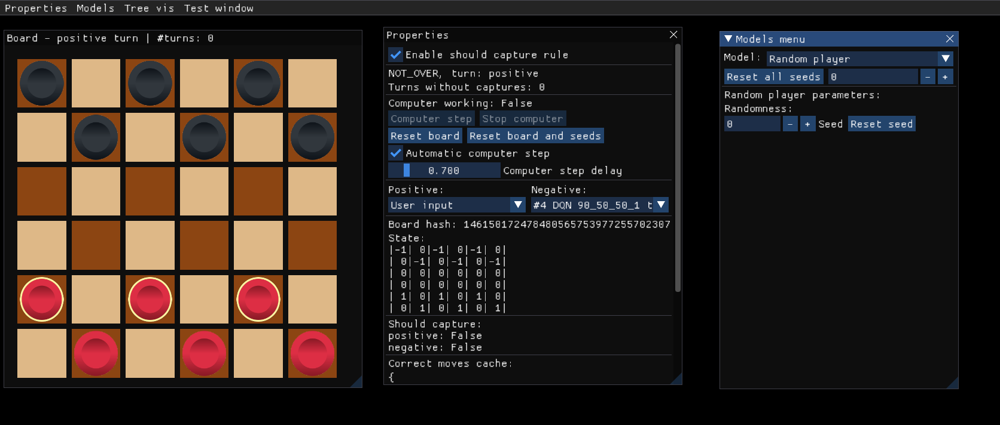

# checkersRL
Using Reinforcement Learning to play American checkers

The used stack is `Python (3.10+)` + `pyimgui(imgui[glfw])` + `Torch2.5`



## Results
Reported results of 50k games with agent being the negative player against the positive random bot:

| # | Agent Name | Win Rate (%) |
|---|------------|--------------|
| 1 | `DQN 90_50_50_1` | $76.908$ |
| 2 | `DQN 90_50_20_1` | $59.670$ |
| 3 | `DQN 90_50_50_1` | $77.732$ |
| **4** | **`DQN 90_50_50_1 t.g. #3`** | $\mathbf{84.448}$ |
| 5 | `DQN 90_52_1` | $78.628$ |
| 0 | `Random Bot` | $50.028$ |

Additional results from using [Double Deep Q-learning](https://github.com/fschur/DDQN-with-PyTorch-for-OpenAI-Gym/) in the same setting:
| # | Agent Name | Win Rate (%) |
|---|------------|--------------|
| 6 | `DDQN 90_50_50_1 q_1` | $80.352$ |
| **7** | **`DDQN 90_50_50_1 q_2`** | $\mathbf{87.564}$ |
| 8 | `DDQN 90_50_50_1 q_2 t.g. #7` | $87.514$ |

## Running the code
First install the packages required by the stack:
```bash
pip install -r requirements.txt
```

Then run the code:
```bash
python gui.py
```

## The rules of American checkers ([YT video](https://youtu.be/ScKIdStgAfU)) ([a text rule source](https://checkers.online/magazine/game/american-checkers-rules)):
1. Board size is 6x6
2. Brown-colored squares start in the bottom right corner
3. Checkers are placed on the dark squares
4. The game goes until one of the players has no more moves
5. Simple checkers can only move forward diagonally one step
6. If, after a capture, the same piece can be captured again, it must do so
7. If a checker reaches the opposite side of the board, it becomes a king
8. Kings can move and capture diagonally in all directions in only one step
9. We have decided that after 50 moves of not capturing any pieces, we should tie the game, or else the game can go on forever.

## Implementation details:
Board could be represented as a 6x6 NumPy array, where
* `2` - king positive checker
* `1` - simple positive checker
* `0` - empty square
* `-1` - simple negative checker
* `-2` - king negative checker
```python
self.__board: list[list[int]] = list(map(list, zip(*[
	[-1, 0, -1, 0, -1, 0],
	[0, -1, 0, -1, 0, -1],
	[0, 0, 0, 0, 0, 0],
	[0, 0, 0, 0, 0, 0],
	[1, 0, 1, 0, 1, 0],
	[0, 1, 0, 1, 0, 1]
])))
```

Agent uses `self.board` and `self.turn_sign`.

#### Fixing the autocomplete issue with pyimgui
The following extension could be used to *Create Cython TypeStub for Python* from the `.pyx` files of the library:

https://marketplace.visualstudio.com/items?itemName=ktnrg45.vscode-cython


#### Description of `Board` class
* `Board.board` - 6x6 NumPy array representing the board
* `Board.check_should_capture(sign)` - function that checks if the player should capture
* `Board.enable_update_should_capture` - bool property that enables/disables the should capture rule
* `Board.turn_sign` - property that returns the sign of the current player
* `Board.game_state` - property that returns the `GameState` enum
* `Board.moves_since_last_capture` - property that returns the number of moves since the last capture
* `Board.is_valid_pos(pos)` - function that checks if the position is on the black square within the board
* `Board.get_possible_pos()` - function that returns positions of the currently playing player
* `Board.get_correct_moves(start)` - function that returns all possible moves for the checker on the `start` position
* `Board.get_correct_moves_cache()` - allows to review cache value of the `get_correct_moves` function
* `Board.is_move_correct(start, end)` - function that checks if the move is correct
* `Board.make_move(start, end)` - function that makes a move and updates the `should_capture` property. WARNING: the move should be correct, otherwise the board will be corrupted
* `Board[(x, y)]` - magic that returns the value of the board at the position `(x, y)`
* `int(Board)` - magic method that returns the integer representation of the board. It could be used to store compressed board class representation or for hashing
* `Board.from_num_repr(int | bytes)` - static method that creates a board from an number representation
